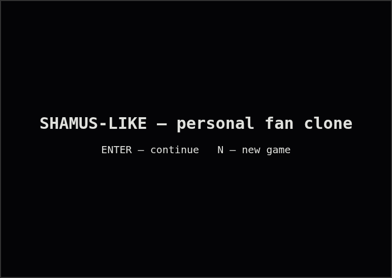
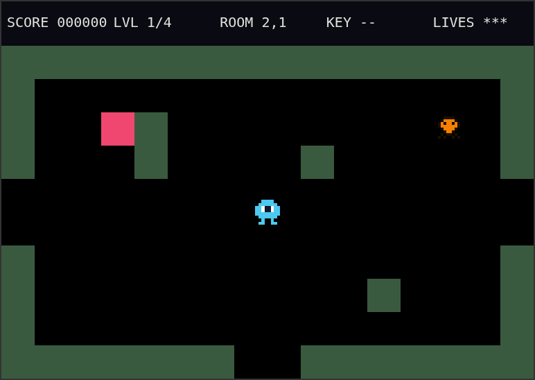
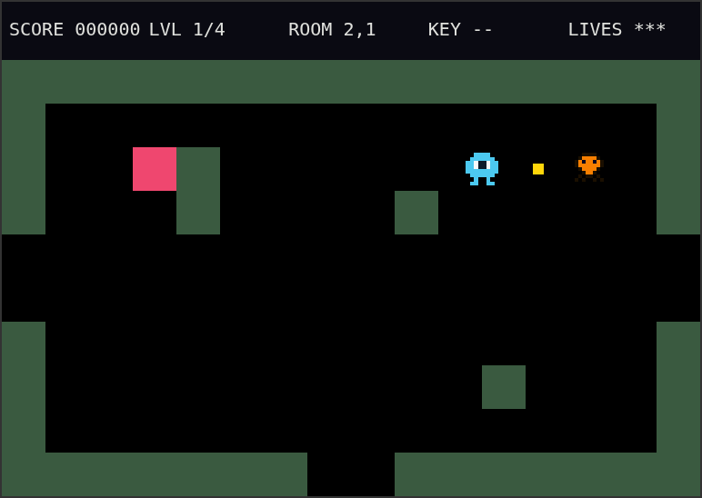
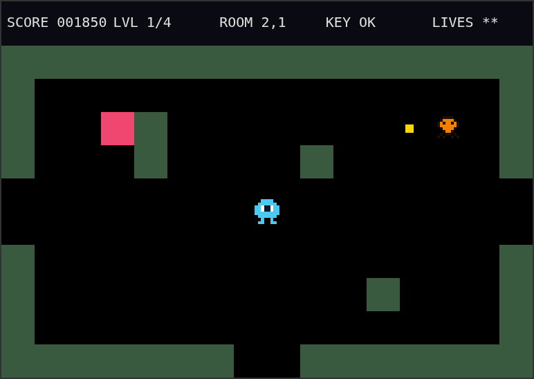
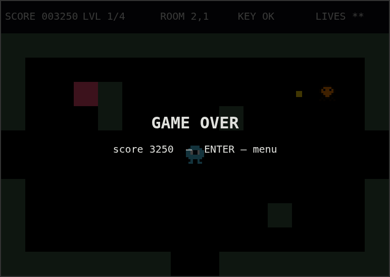
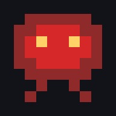
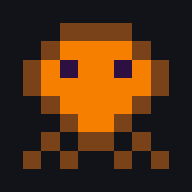
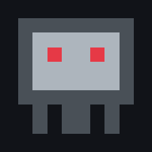
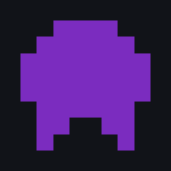

# Shamus-like — 个人同人复刻

**Languages:** [English](README.md) · [中文](README.zh.md) · [Русский](README.ru.md)

个人非商业性质的 *Shamus* 同人复刻。

安装和运行说明、项目结构请参见 [CONTRIBUTING.md](CONTRIBUTING.md)（仅英文）。

### 游戏截图

| | |
|---|---|
|  菜单界面 |  探索房间 —— 附近有一只「琥珀追猎者」 |
|  子弹飞行中 |  获得钥匙 —— HUD 显示 KEY OK |
|  游戏结束 | |

### 操作方式

- **WASD / 方向键** — 移动
- **空格键** — 射击（最多可同时有 2 发子弹在空中，与原作一致）
- **P** — 暂停
- **N** — 新游戏（在菜单中，会清除存档）
- **Enter** — 确认 / 继续已保存的游戏

在触屏设备（手机/平板）上，界面会自动用虚拟摇杆和射击按钮替代键盘提示 —— 详见下方
"触屏操作与 iOS 安装"。

进度（关卡、房间、分数、已收集的钥匙）会自动保存到浏览器的 `localStorage` 中 — 无需
服务器。

### 触屏操作与 iOS 安装

在支持触控的设备上，游戏会检测到没有物理键盘，并显示一个屏幕虚拟摇杆（拖动以移动）和
一个射击按钮，二者接入的是与键盘完全相同的输入系统 —— 不存在需要单独维护的触控代码
路径。

本项目也支持作为独立应用安装（PWA）：

- **iOS（Safari）：** 打开游戏的网址，点击分享图标，选择"添加到主屏幕"。安装后会以
  全屏方式启动，带有自己的图标，没有浏览器界面。
- **Android（Chrome）：** 打开网址后，通过菜单选择"添加到主屏幕"/"安装应用"（Chrome
  也可能会通过横幅自动提示）。

安装后，Service Worker 会缓存游戏文件，使其在首次加载后也能离线运行。由于本项目没有
构建步骤，Service Worker 采用"网络优先"策略（始终优先尝试网络，失败时回退到缓存），
这样开发过程中的本地修改就不会被陈旧的缓存所掩盖 —— 详见 [CONTRIBUTING.md](CONTRIBUTING.md)。

### 关卡生成原理

每一关都是一个由 32 个房间组成的图（8×4 网格）；连通性由生成树保证（再加上少量额外的
边用于增加变化/形成回路）。生成过程是确定性的（固定种子）— 每次运行都会得到相同的、
持久存在的世界，这与原作一致（不同于 Berzerk，那款游戏的房间是随机生成的）。

钥匙-锁门推进机制：在从起始房间到出口的图路径上选择一条边，使得移除它确实会把图分割
成两个不连通的部分（通过 BFS 验证 —— 如果移除某条边后，仍可通过另一条路径到达出口，
那么这条边不合格，会继续尝试下一条）。钥匙会被放置在一个无需跨越该边即可到达的房间
里。这样就保证了没有钥匙时出口在物理上是不可达的。偶尔（如果路径上的所有边都因为回路
而变成"非关键"边）某一关可能最终没有锁 —— 这种情况下该关就是完全开放的；这是一种安全
的兜底方案，不是 bug。

### 怪物与道具

| 精灵 | 名称 | 说明 |
|---|---|---|
|  | **深红徘徊者**（Crimson Drone） | 在房间里随机游荡，每隔 1–3 秒随机改变方向。不会记住玩家的位置 —— 是否与你相遇纯靠运气。 |
|  | **琥珀追猎者**（Amber Stalker） | 大多数时候和「深红徘徊者」一样随机游荡，但每一帧都有约 2% 的小概率转向并直冲向你 —— 一种轻度、不可预测的追击。 |
|  | **铁哨兵**（Iron Sentinel） | 移动速度比其他敌人慢得多，几乎不怎么游走，但每隔几秒（默认 2–3.5 秒，见 `constants.js` 中的 `SHOOTER_FIRE_MIN`/`SHOOTER_FIRE_MAX`）会瞄准你所在的位置发射一发子弹。同一时间它只会有一发子弹在飞行中 —— 有充足的时间躲避或将其击落。你的子弹碰到它的子弹会将其摧毁。 |
|  | **影子**（Shadow） | 如果你在一个房间里停留过久就会出现 —— 默认 14 秒（`constants.js` 中的 `SHADOW_TIMEOUT`）。它无法被击杀，且会径直朝你追来 —— 射击只能将其短暂击晕，不能消灭它。 |
|  | **钥匙**（Key） | 用于打开通往本关出口的锁门。总是被放置在一个无需跨越那扇锁门即可到达的房间里。 |
|  | **出口**（Exit） | 到达出口即可通关并进入下一关。在收集到本关的钥匙（如果本关有锁的话）之前无法到达。 |

### 已知的简化与特殊之处（有意为之，非 bug）

- 目前所有伤害来源（敌人、电墙）都统一扣除一条命，并附带短暂的无敌时间 —— 在原作中，
  电墙会无条件立即致死；这里做了有意的简化，避免游戏过于苛刻。
- 房间内部的障碍物由程序按照"不阻挡中心区域、且绝不阻挡门口周围区域"的规则放置；理论
  上仍有极小概率出现不太合理的房间布局 —— 可以通过手动编辑
  `src/data/room-overrides.json` 中对应房间的条目来修复（见
  [CONTRIBUTING.md](CONTRIBUTING.md)）。
- 没有后端，也没有云存档 —— 仅使用 `localStorage`，作用范围限定在某一设备的某一浏览
  器内。

### 后续开发构想

- 更丰富的敌人 AI 行为模式。
- 手柄支持。
